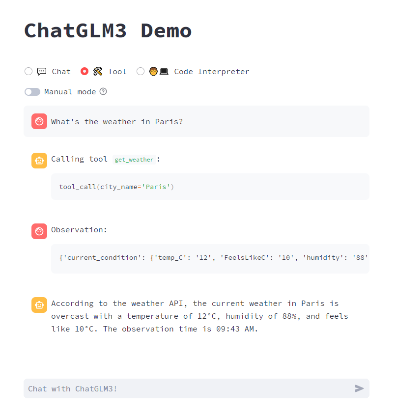
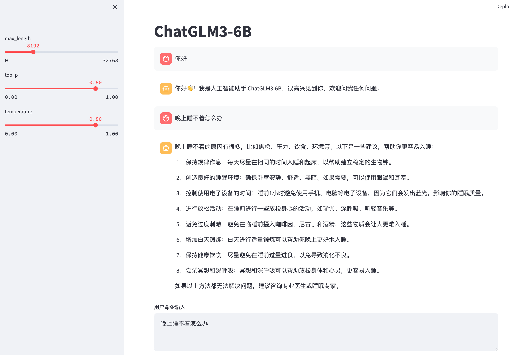

# ChatGLM3

<p align="center">
🤗 <a href="https://huggingface.co/THUDM/chatglm3-6b" target="_blank">HF Repo</a> • 🤖 <a href="https://modelscope.cn/models/ZhipuAI/chatglm3-6b" target="_blank">ModelScope</a>  • 🐦 <a href="https://twitter.com/thukeg" target="_blank">Twitter</a> • 📃 <a href="https://arxiv.org/abs/2103.10360" target="_blank">[GLM@ACL 22]</a> <a href="https://github.com/THUDM/GLM" target="_blank">[GitHub]</a> • 📃 <a href="https://arxiv.org/abs/2210.02414" target="_blank">[GLM-130B@ICLR 23]</a> <a href="https://github.com/THUDM/GLM-130B" target="_blank">[GitHub]</a> <br>
</p>
<p align="center">
    👋 Join our <a href="https://join.slack.com/t/chatglm/shared_invite/zt-25ti5uohv-A_hs~am_D3Q8XPZMpj7wwQ" target="_blank">Slack</a> and <a href="resources/WECHAT.md" target="_blank">WeChat</a>
</p>
<p align="center">
📍Experience the larger-scale ChatGLM model at <a href="https://www.chatglm.cn">chatglm.cn</a>
</p>

## Introduction

ChatGLM3 is a new generation of pre-trained dialogue models jointly released by Zhipu AI and Tsinghua KEG. ChatGLM3-6B is the open-source model in the ChatGLM3 series, maintaining many excellent features of the first two generations such as smooth dialogue and low deployment threshold, while introducing the following features:

1. **Stronger Base Model:** The base model of ChatGLM3-6B, ChatGLM3-6B-Base, adopts a more diverse training dataset, more sufficient training steps, and a more reasonable training strategy. Evaluations on datasets from various perspectives such as semantics, mathematics, reasoning, code, and knowledge show that **ChatGLM3-6B-Base has the strongest performance among base models below 10B**.

2. **More Complete Function Support:** ChatGLM3-6B adopts a newly designed [Prompt format](PROMPT_en.md), supporting multi-turn dialogues as usual. It also natively supports [tool invocation](tool_using/README_en.md) (Function Call), code execution (Code Interpreter), and Agent tasks in complex scenarios.

3. **More Comprehensive Open-source Series:** In addition to the dialogue model [ChatGLM3-6B](https://huggingface.co/THUDM/chatglm3-6b), the basic model [ChatGLM3-6B-Base](https://huggingface.co/THUDM/chatglm3-6b-base), and the long-text dialogue model [ChatGLM3-6B-32K](https://huggingface.co/THUDM/chatglm3-6b-32k) have also been open-sourced. All these weights are **fully open** for academic research, and **free commercial use is also allowed** after registration via a [questionnaire](https://open.bigmodel.cn/mla/form).

-----

The ChatGLM3 open-source model aims to promote the development of large-model technology together with the open-source community. Developers and everyone are earnestly requested to comply with the [open-source protocol](MODEL_LICENSE), and not to use the open-source models, codes, and derivatives for any purposes that might harm the nation and society, and for any services that have not been evaluated and filed for safety. Currently, no applications, including web, Android, Apple iOS, and Windows App, have been developed based on the **ChatGLM3 open-source model** by our project team.

Although every effort has been made to ensure the compliance and accuracy of the data at various stages of model training, due to the smaller scale of the ChatGLM3-6B model and the influence of probabilistic randomness factors, the accuracy of output content cannot be guaranteed. The model output is also easily misled by user input. **This project does not assume risks and liabilities caused by data security, public opinion risks, or any misleading, abuse, dissemination, and improper use of open-source models and codes.**

## Model List

| Model | Seq Length |                                                              Download                                                               
| :---: |:---------------------------:|:-----------------------------------------------------------------------------------------------------------------------------------:
| ChatGLM3-6B | 8k |      [HuggingFace](https://huggingface.co/THUDM/chatglm3-6b) \| [ModelScope](https://modelscope.cn/models/ZhipuAI/chatglm3-6b)      
| ChatGLM3-6B-Base | 8k | [HuggingFace](https://huggingface.co/THUDM/chatglm3-6b-base) \| [ModelScope](https://modelscope.cn/models/ZhipuAI/chatglm3-6b-base) 
| ChatGLM3-6B-32K | 32k |                                   [HuggingFace](https://huggingface.co/THUDM/chatglm3-6b-32k) \| [ModelScope](https://modelscope.cn/models/ZhipuAI/chatglm3-6b-32k)                                    

## Projects
Open source projects that accelerate ChatGLM3:
* [chatglm.cpp](https://github.com/li-plus/chatglm.cpp): Real-time inference on your laptop accelerated by quantization, similar to llama.cpp.
* [ChatGLM3-TPU](https://github.com/sophgo/ChatGLM3-TPU): Using the TPU accelerated inference solution, it runs about 7.5 token/s in real time on the end-side chip BM1684X (16T@FP16, 16G DDR).

## Evaluation Results

### Typical Tasks

We selected 8 typical Chinese-English datasets and conducted performance tests on the ChatGLM3-6B (base) version.

| Model            | GSM8K | MATH | BBH  | MMLU | C-Eval | CMMLU | MBPP | AGIEval |
|------------------|:-----:|:----:|:----:|:----:|:------:|:-----:|:----:|:-------:|
| ChatGLM2-6B-Base | 32.4  | 6.5  | 33.7 | 47.9 |  51.7  | 50.0  |  -   |    -    |
| Best Baseline    | 52.1  | 13.1 | 45.0 | 60.1 |  63.5  | 62.2  | 47.5 |  45.8   |
| ChatGLM3-6B-Base | 72.3  | 25.7 | 66.1 | 61.4 |  69.0  | 67.5  | 52.4 |  53.7   |
> "Best Baseline" refers to the pre-trained models that perform best on the corresponding datasets with model parameters below 10B, excluding models that are trained specifically for a single task and do not maintain general capabilities.

> In the tests of ChatGLM3-6B-Base, BBH used a 3-shot test, GSM8K and MATH that require inference used a 0-shot CoT test, MBPP used a 0-shot generation followed by running test cases to calculate Pass@1, and other multiple-choice type datasets all used a 0-shot test.

We have conducted manual evaluation tests on ChatGLM3-6B-32K in multiple long-text application scenarios. Compared with the second-generation model, its effect has improved by more than 50% on average. In applications such as paper reading, document summarization, and financial report analysis, this improvement is particularly significant. In addition, we also tested the model on the LongBench evaluation set, and the specific results are shown in the table below.

| Model                |  Average |  Summary | Single-Doc QA |  Multi-Doc QA | Code | Few-shot | Synthetic | 
|----------------------|:-----:|:----:|:----:|:----:|:------:|:-----:|:-----:|
| ChatGLM2-6B-32K   |  41.5 | 24.8 | 37.6 | 34.7 |  52.8  |  51.3 | 47.7 | 
| ChatGLM3-6B-32K   |  50.2 | 26.6 | 45.8 | 46.1 |  56.2  |  61.2 | 65 |


## How to Use

### Environment Installation
First, you need to download this repository:
```shell
git clone https://github.com/THUDM/ChatGLM3
cd ChatGLM3
```

Then use pip to install the dependencies:
```
pip install -r requirements.txt
```
+ The `transformers` library version should be `4.30.2` and above, and `torch` library should be 2.0 and above to obtain the best inference performance.
+ In order to ensure that the version of `torch` is correct, please strictly follow the instructions of [official documentation](https://pytorch.org/get-started/locally/) for installation.
+ The `gradio` library version should be the `3.x` version.


### Integrated Demo

We provide an integrated demo that incorporates the following three functionalities. Please refer to [Integrated Demo](composite_demo/README_en.md) for how to run it.

- Chat: Dialogue mode, where you can interact with the model.
- Tool: Tool mode, where in addition to dialogue, the model can also perform other operations using tools.
    
- Code Interpreter: Code interpreter mode, where the model can execute code in a Jupyter environment and obtain results to complete complex tasks.
    

### Usage 

The ChatGLM model can be called to start a conversation using the following code:

```python
>>> from transformers import AutoTokenizer, AutoModel
>>> tokenizer = AutoTokenizer.from_pretrained("THUDM/chatglm3-6b", trust_remote_code=True)
>>> model = AutoModel.from_pretrained("THUDM/chatglm3-6b", trust_remote_code=True, device='cuda')
>>> model = model.eval()
>>> response, history = model.chat(tokenizer, "Hello", history=[])
>>> print(response)
Hello 👋! I'm ChatGLM3-6B, the artificial intelligence assistant, nice to meet you. Feel free to ask me any questions.
>>> response, history = model.chat(tokenizer, "What should I do if I can't sleep at night", history=history)
>>> print(response)
If you're having trouble sleeping at night, here are a few suggestions that might help:

1. Create a relaxing sleep environment: Make sure your bedroom is cool, quiet, and dark. Consider using earplugs, a white noise machine, or a fan to help create an optimal environment.
2. Establish a bedtime routine: Try to go to bed and wake up at the same time every day, even on weekends. A consistent routine can help regulate your body's internal clock.
3. Avoid stimulating activities before bedtime: Avoid using electronic devices, watching TV, or engaging in stimulating activities like exercise or puzzle-solving, as these can interfere with your ability to fall asleep.
4. Limit caffeine and alcohol: Avoid consuming caffeine and alcohol close to bedtime, as these can disrupt your sleep patterns.
5. Practice relaxation techniques: Try meditation, deep breathing, or progressive muscle relaxation to help calm your mind and body before sleep.
6. Consider taking a warm bath or shower: A warm bath or shower can help relax your muscles and promote sleep.
7. Get some fresh air: Make sure to get some fresh air during the day, as lack of vitamin D can interfere with sleep quality.

If you continue to have difficulty sleeping, consult with a healthcare professional for further guidance and support.
```

#### Load Model Locally
The above code will automatically download the model implementation and parameters by `transformers`. The complete model implementation is available on [Hugging Face Hub](https://huggingface.co/THUDM/chatglm3-6b). If your network environment is poor, downloading model parameters might take a long time or even fail. In this case, you can first download the model to your local machine, and then load it from there.

To download the model from Hugging Face Hub, you need to [install Git LFS](https://docs.github.com/en/repositories/working-with-files/managing-large-files/installing-git-large-file-storage) first, then run
```Shell
git clone https://huggingface.co/THUDM/chatglm3-6b
```

If the download from HuggingFace is slow, you can also download it from [ModelScope](https://modelscope.cn/models/ZhipuAI/chatglm3-6b).

### Web-based Dialogue Demo

You can launch a web-based demo using Gradio with the following command:
```shell
python web_demo.py
```



You can launch a web-based demo using Streamlit with the following command:
```shell
streamlit run web_demo2.py
```

The web-based demo will run a Web Server and output an address. You can use it by opening the output address in a browser. Based on tests, the web-based demo using Streamlit runs more smoothly.

### Command Line Dialogue Demo


Run [cli_demo.py](basic_demo/cli_demo.py) in the repository:

```shell
python cli_demo.py
```

The program will interact in the command line, enter instructions in the command line and hit enter to generate a response. Enter `clear` to clear the dialogue history, enter `stop` to terminate the program.

### API Deployment
Thanks to [@xusenlinzy](https://github.com/xusenlinzy) for implementing the OpenAI format streaming API deployment, which can serve as the backend for any ChatGPT-based application, such as [ChatGPT-Next-Web](https://github.com/Yidadaa/ChatGPT-Next-Web). You can deploy it by running [openai_api.py](openai_api_demo/openai_api.py) in the repository:
```shell
cd openai_api_demo
python openai_api.py
```
Also, we have written a sample code to test the performance of the API calls. This can be tested by running [openai_api_request.py](openai_api_demo/openai_api_request.py) in the repository
+ Test with Curl
```shell
curl -X POST "http://127.0.0.1:8000/v1/chat/completions" \
-H "Content-Type: application/json" \\
-d "{\"model\": \"chatglm3-6b\", \"messages\": [{\"role\": \"system\", \"content\": \"You are ChatGLM3, a large language model trained by Zhipu. Follow the user's instructions carefully. Respond using markdown.\"}, {\"role\": \"user\", \"content\": \"Hello, tell me a story, about 100 words\"}], \"stream\": false, \"max_title": \"\". false, \"max_tokens\": 100, \"temperature\": 0.8, \"top_p\": 0.8}"
````
+ Testing with Python
```shell
cd openai_api_demo
python openai_api_request.py
```
If the test is successful, the model should return a story.

### Tool Invocation

For methods of tool invocation, please refer to [Tool Invocation](tool_using/README_en.md).

## Low-Cost Deployment

### Model Quantization

By default, the model is loaded with FP16 precision, running the above code requires about 13GB of VRAM. If your GPU's VRAM is limited, you can try loading the model quantitatively, as follows:

```python
model = AutoModel.from_pretrained("THUDM/chatglm3-6b",trust_remote_code=True).quantize(4).cuda()
```

Model quantization will bring some performance loss. Through testing, ChatGLM3-6B can still perform natural and smooth generation under 4-bit quantization.

### CPU Deployment

If you don't have GPU hardware, you can also run inference on the CPU, but the inference speed will be slower. The usage is as follows (requires about 32GB of memory):

```python
model = AutoModel.from_pretrained("THUDM/chatglm3-6b", trust_remote_code=True).float()
```

### Mac Deployment

For Macs equipped with Apple Silicon or AMD GPUs, the MPS backend can be used to run ChatGLM3-6B on the GPU. Refer to Apple's [official instructions](https://developer.apple.com/metal/pytorch) to install PyTorch-Nightly (the correct version number should be 2.x.x.dev2023xxxx, not 2.x.x).

Currently, only [loading the model locally](README_en.md#load-model-locally) is supported on MacOS. Change the model loading in the code to load locally and use the MPS backend:

```python
model = AutoModel.from_pretrained("your local path", trust_remote_code=True).to('mps')
```

Loading the half-precision ChatGLM3-6B model requires about 13GB of memory. Machines with smaller memory (such as a 16GB memory MacBook Pro) will use virtual memory on the hard disk when there is insufficient free memory, resulting in a significant slowdown in inference speed.

### Multi-GPU Deployment

If you have multiple GPUs, but each GPU's VRAM size is not enough to accommodate the complete model, then the model can be split across multiple GPUs. First, install accelerate: `pip install accelerate`, and then load the model through the following methods:

```python
from utils import load_model_on_gpus

model = load_model_on_gpus("THUDM/chatglm3-6b", num_gpus=2)
```

This allows the model to be deployed on two GPUs for inference. You can change `num_gpus` to the number of GPUs you want to use. It is evenly split by default, but you can also pass the `device_map` parameter to specify it yourself.

## Citation

If you find our work helpful, please consider citing the following papers.

```
@article{zeng2022glm,
  title={Glm-130b: An open bilingual pre-trained model},
  author={Zeng, Aohan and Liu, Xiao and Du, Zhengxiao and Wang, Zihan and Lai, Hanyu and Ding, Ming and Yang, Zhuoyi and Xu, Yifan and Zheng, Wendi and Xia, Xiao and others},
  journal={arXiv preprint arXiv:2210.02414},
  year={2022}
}
```
```
@inproceedings{du2022glm,
  title={GLM: General Language Model Pretraining with Autoregressive Blank Infilling},
  author={Du, Zhengxiao and Qian, Yujie and Liu, Xiao and Ding, Ming and Qiu, Jiezhong and Yang, Zhilin and Tang, Jie},
  booktitle={Proceedings of the 60th Annual Meeting of the Association for Computational Linguistics (Volume 1: Long Papers)},
  pages={320--335},
  year={2022}
}
```
