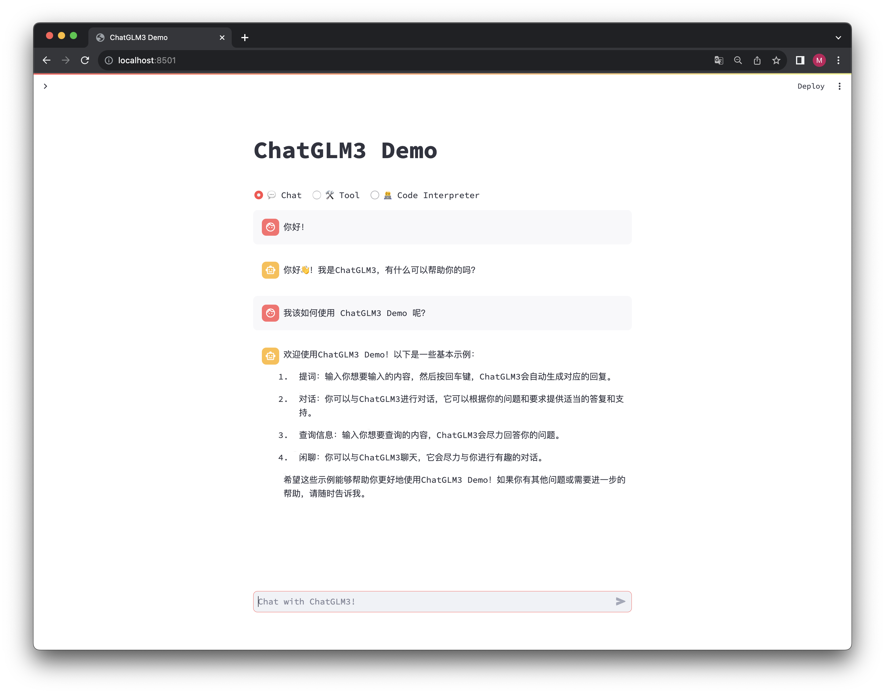
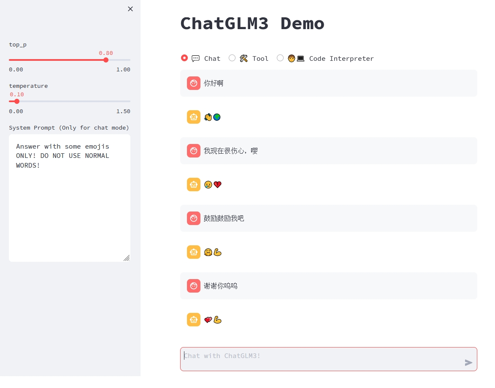
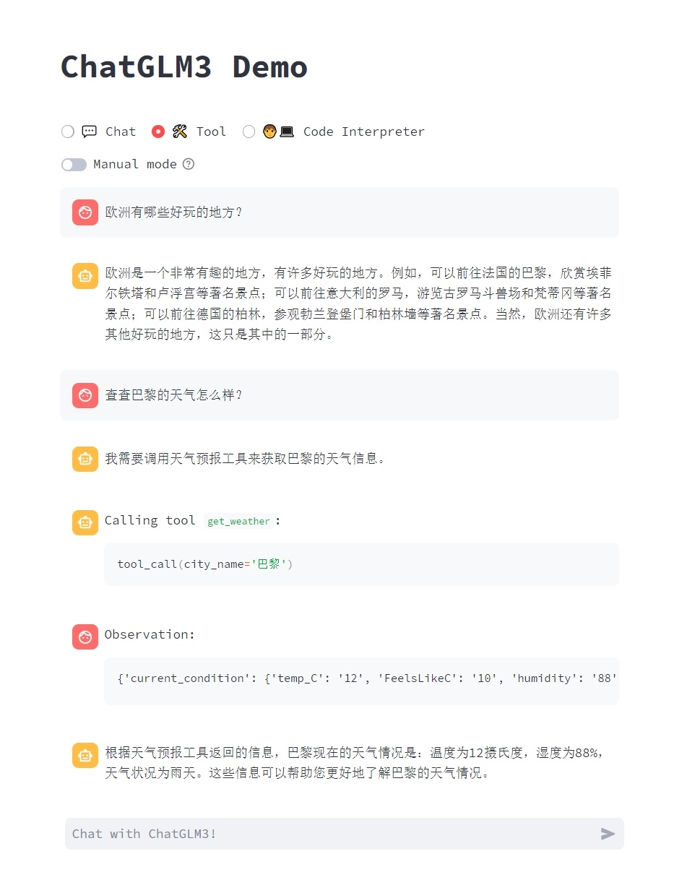
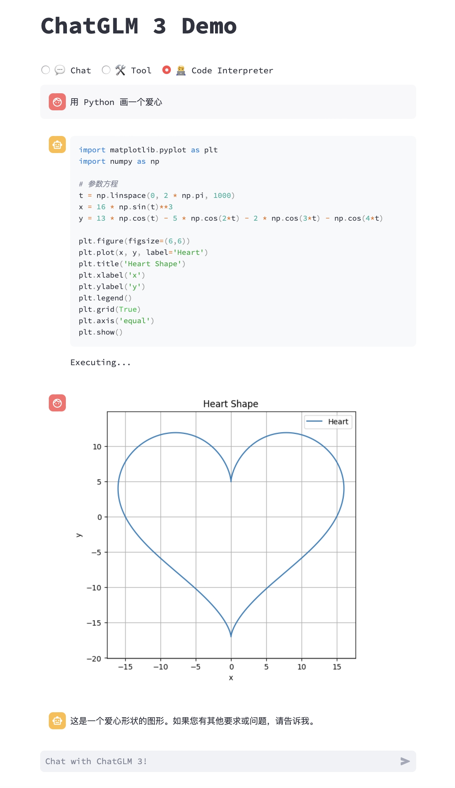

# ChatGLM3 Web Demo



## 安装

我们建议通过 [Conda](https://docs.conda.io/en/latest/) 进行环境管理。

执行以下命令新建一个 conda 环境并安装所需依赖：

```bash
conda create -n chatglm3-demo python=3.10
conda activate chatglm3-demo
pip install -r requirements.txt
```

请注意，本项目需要 Python 3.10 或更高版本。

此外，使用 Code Interpreter 还需要安装 Jupyter 内核：

```bash
ipython kernel install --name chatglm3-demo --user
```

## 运行

运行以下命令在本地加载模型并启动 demo：

```bash
streamlit run main.py
```

之后即可从命令行中看到 demo 的地址，点击即可访问。初次访问需要下载并加载模型，可能需要花费一定时间。

如果已经在本地下载了模型，可以通过 `export MODEL_PATH=/path/to/model` 来指定从本地加载模型。如果需要自定义 Jupyter 内核，可以通过 `export IPYKERNEL=<kernel_name>` 来指定。

## 使用

ChatGLM3 Demo 拥有三种模式：

- Chat: 对话模式，在此模式下可以与模型进行对话。
- Tool: 工具模式，模型除了对话外，还可以通过工具进行其他操作。
- Code Interpreter: 代码解释器模式，模型可以在一个 Jupyter 环境中执行代码并获取结果，以完成复杂任务。

### 对话模式

对话模式下，用户可以直接在侧边栏修改 top_p, temperature, System Prompt 等参数来调整模型的行为。例如



### 工具模式

可以通过在 `tool_registry.py` 中注册新的工具来增强模型的能力。只需要使用 `@register_tool` 装饰函数即可完成注册。对于工具声明，函数名称即为工具的名称，函数 docstring 即为工具的说明；对于工具的参数，使用 `Annotated[typ: type, description: str, required: bool]` 标注参数的类型、描述和是否必须。

例如，`get_weather` 工具的注册如下：

```python
@register_tool
def get_weather(
    city_name: Annotated[str, 'The name of the city to be queried', True],
) -> str:
    """
    Get the weather for `city_name` in the following week
    """
    ...
```



此外，你也可以在页面中通过 `Manual mode` 进入手动模式，在这一模式下你可以通过 YAML 来直接指定工具列表，但你需要手动将工具的输出反馈给模型。

### 代码解释器模式

由于拥有代码执行环境，此模式下的模型能够执行更为复杂的任务，例如绘制图表、执行符号运算等等。模型会根据对任务完成情况的理解自动地连续执行多个代码块，直到任务完成。因此，在这一模式下，你只需要指明希望模型执行的任务即可。

例如，我们可以让 ChatGLM3 画一个爱心：



### 额外技巧

- 在模型生成文本时，可以通过页面右上角的 `Stop` 按钮进行打断。
- 刷新页面即可清空对话记录。

# Enjoy!